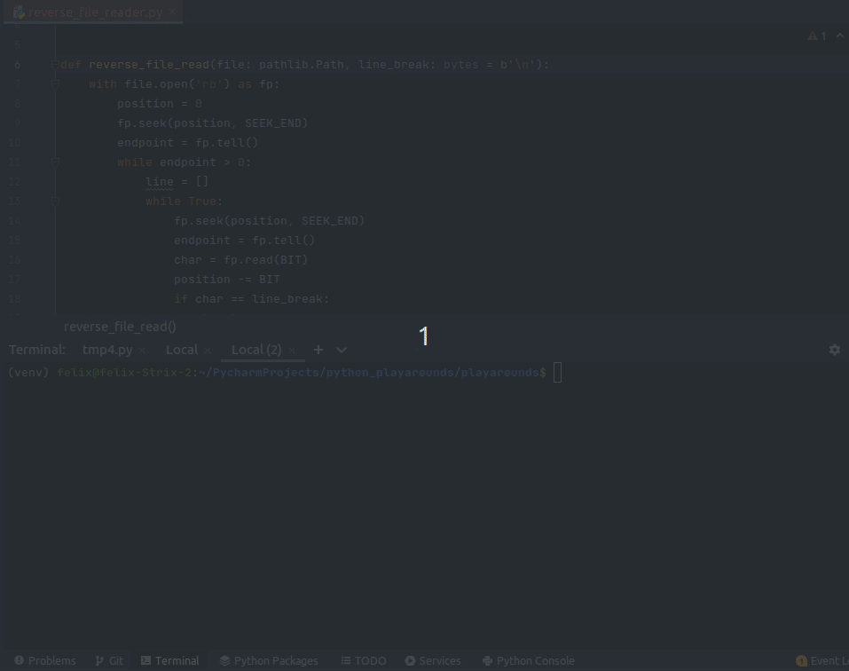

# docstring_generator
Auto generate docstring from type-hints.


## Usage
You can run this directly from the terminal
```shell
gendocs folder/example_file.py
```



### Example
Here a before and after example

__example_file.py__
#### Before:
```python
from typing import Dict
from typing import Literal
from typing import Union


def foo(
    val_a: Literal["foo", "bar"],
    val_b: Dict[str, Union[int, float]],
    val_c: str = "Hello World",
) -> Dict[str, Union[int, float]]:
    """
    Lorem ipsum dolor sit amet, consetetur sadipscing elitr,
    sed diam nonumy eirmod tempor invidunt ut labore et dolore magna aliquyam
    """


def bar(val_a: int, val_b: int) -> int:
    pass


class Vehicle:
    """
    The Vehicle object contains lots of vehicles
    """

    def __init__(self, arg: str, *args, **kwargs):
        """
        $2 at least one value of type string is needed
        """
        self.arg = arg

    def cars(self, distance: float, destination: str):
        pass

    def fuel(self, fuel):
        """
        Some text
        """
        pass
```
#### After:
```python
from typing import Dict
from typing import Literal
from typing import Union


def foo(
    val_a: Literal["foo", "bar"],
    val_b: Dict[str, Union[int, float]],
    val_c: str = "Hello World",
) -> Dict[str, Union[int, float]]:
    """
    Lorem ipsum dolor sit amet, consetetur sadipscing elitr,
    sed diam nonumy eirmod tempor invidunt ut labore et dolore magna aliquyam
    
    
    Parameters
    ----------
    val_a : argument of type `str` allowed values are `foo` or `bar`
    val_b : argument of type Dict(str, int or float)
    val_c : argument of type str
    	Default is Hello World
    
    Returns
    -------
    Dict(str, int or float)
    """


def bar(val_a: int, val_b: int) -> int:
    """
    Function bar
    
    
    Parameters
    ----------
    val_a : argument of type int
    val_b : argument of type int
    
    Returns
    -------
    int
    """
    pass


class Vehicle:
    """
    The Vehicle object contains lots of vehicles
    
    
    Parameters
    ----------
    arg : argument of type str
    args : variadic arguments of type tuple
    	at least one value of type string is needed
    kwargs : variadic keyword arguments of type dict
    """

    def __init__(self, arg: str, *args, **kwargs):
        """
        $2 at least one value of type string is needed
        """
        self.arg = arg

    def cars(self, distance: float, destination: str):
        """
        Function cars
        
        
        Parameters
        ----------
        distance : argument of type float
        destination : argument of type str
        """
        pass

    def fuel(self, fuel):
        """
        Some text
        """
        pass
```

## Options
- --style [numpy, rest]
- --ignore-classes
- --ignore-functions
- --help

### Installation
- pip install docstring-generator

### Versioning
- For the versions available, see the tags on this repository.

### Authors
- Felix Eisenmenger

### License
- This project is licensed under the MIT License - see the LICENSE.md file for details
