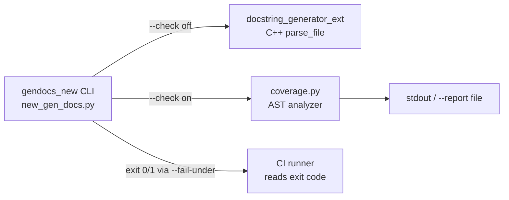

CLI surface

Report output formats

Feature scope

# Feasibility & Overview

### How easy is this to achieve?

**Short answer: medium-easy — a few hours of focused work, no C++ changes needed.**

The reason it's tractable: the existing tool (`src/docstring_generator/new_gen_docs.py`) is a 38-line Click wrapper around the C++ `docstring_generator_ext.parse_file()` — mutation lives entirely inside the extension. Coverage analysis, however, is a **read-only** concern and can be done in pure Python using the stdlib `ast` module, without touching the C++ side at all. That decouples the feature from the extension's release cycle.

### Scope for this iteration (per user's answers)

- **Only** docstring coverage analysis (does each function/method have a docstring, and what's the % score).
- **Only** JSON report output.
- CLI surface: add a `--check` flag to the existing `gendocs_new` command (no new binary).

Explicitly deferred (can be follow-ups): human-readable terminal report, JUnit XML, GH Actions annotations, coverage badge, diff-based coverage, ready-to-use CI workflow templates.

### Complexity summary

 Piece | Complexity | Why |
---|---|---|
 AST-based coverage analyzer | Low | Standard `ast.NodeVisitor`; ~80 LOC. |
 `--check` mode wiring | Low | New Click flag, skip `parse_file`, run analyzer instead. |
 JSON report + exit code | Low | `json.dumps` + `sys.exit(1)` on threshold breach. |
 Tests | Low | Fixture `.py` files with/without docstrings under `tests/`. |
 README/CI usage docs | Low | New section + tick the roadmap item. |

Total: fits in a single, self-contained PR.

# Requirements

### Overview & Goals

Make `docstring_generator` usable as a **CI gate**: a project can run `gendocs_new --check src/` in CI, get a machine-readable JSON coverage report, and fail the build if coverage drops below a configurable threshold.

### Scope

**In scope**
- New `--check` flag on the existing `gendocs_new` CLI.
- Pure-Python (`ast`) analyzer that classifies every top-level function, nested function, and class method as *documented* or *undocumented*.
- JSON report (to stdout by default, or to a file via `--report`).
- Configurable minimum-coverage threshold via `--fail-under` (float, default `0` = never fail).
- Non-zero exit code when threshold is breached, so CI naturally fails.
- Documented CI usage snippet in `README.md` + tick the roadmap item.

**Out of scope (this iteration)**
- Human-readable terminal report, JUnit XML, SVG badge, GH annotations.
- Diff-based / PR-only coverage.
- Ready-to-use `.github/workflows/*.yml` shipped in the repo.
- Detecting *outdated* docstrings (signature drifted from `Parameters` block) — flagged as future work.

### User Stories

- As a maintainer, I want to run `gendocs_new --check src/` in CI so that PRs adding undocumented functions fail automatically.
- As a maintainer, I want a JSON report so I can feed it into a dashboard or a downstream script.
- As a contributor, I want the check to *not* modify files, so CI never introduces surprise diffs.

### Functional Requirements

- `gendocs_new --check <paths…>` must **never** call `docstring_generator_ext.parse_file` (read-only guarantee).
- The analyzer walks each `*.py` file under the given paths and produces per-function records:
  - `file`, `qualname` (e.g. `PluginConfig.validate_api_config`), `lineno`, `is_documented` (bool), `kind` (`function` | `method` | `async_function`).
- Coverage is computed as `documented / total * 100`, rounded to 2 decimals; if `total == 0`, coverage is reported as `100.0`.
- Output modes:
  - Default: emit JSON to **stdout**.
  - `--report path/to/file.json`: write JSON to that path (create parent dirs), print nothing to stdout.
- `--fail-under X` (float 0–100): exit code `1` if `coverage < X`, else `0`. Absent → never fail on coverage.
- Existing behavior (no `--check`) is unchanged.

### Non-Functional Requirements

- No new runtime dependencies — stdlib only (`ast`, `json`, `pathlib`, `sys`).
- Deterministic output (stable ordering: files sorted, functions in source order).
- Must import cleanly even if `docstring_generator_ext` is missing (analyzer is pure Python).

# Technical Design

### Current Implementation

- `src/docstring_generator/new_gen_docs.py` is the only Python source file. It:
  1. Parses `--style`.
  2. Iterates paths.
  3. For each `.py` file, calls `docstring_generator_ext.parse_file(path, style)` which mutates the file in place.
- `pyproject.toml` exposes a single script: `gendocs_new = "docstring_generator.new_gen_docs:main"`.
- No tests exercise the CLI directly; `tests/tmp/` holds fixture files.

### Key Decisions

1. **Pure-Python analyzer, not a C++ extension change.** Coverage is read-only and orthogonal to generation; keeping it in Python avoids bumping `docstring_generator_ext` and works even without the extension installed.
2. **`--check` disables mutation entirely.** When `--check` is set, `parse_file` is never called. This makes the flag a strict CI-safe read-only mode, matching the convention used by `black --check` and `ruff check`.
3. **JSON to stdout by default, optional `--report` file.** Fits `gh run` log capture and downstream tooling without needing a temp file.
4. **Coverage rule = presence of any non-empty docstring** (i.e. `ast.get_docstring(node)` returns a non-empty string). Simple, explainable, no false positives. Detecting "outdated" docstrings is left for a future iteration and explicitly noted in the report schema (`schema_version`).
5. **`--fail-under` is the only failure knob** (mirrors `coverage.py`), keeping CI wiring predictable.

### Proposed Changes

- **New module** `src/docstring_generator/coverage.py`:
  - `@dataclass FunctionRecord`.
  - `class DocstringCoverageVisitor(ast.NodeVisitor)` — walks `FunctionDef`, `AsyncFunctionDef`, tracks class context for `qualname`, uses `ast.get_docstring(node)` to decide `is_documented`.
  - `analyze_file(path: Path) -> list[FunctionRecord]`.
  - `analyze_paths(paths: Iterable[Path]) -> CoverageReport` — expands directories via `**/*.py`, aggregates.
  - `CoverageReport.to_dict()` → JSON-serializable dict matching the schema below.
- **Modify** `src/docstring_generator/new_gen_docs.py`:
  - Add `--check`, `--report`, `--fail-under` Click options.
  - Early-return branch when `--check` is set: run `analyze_paths`, emit JSON, exit with `1` if `coverage < fail_under`, else `0`.
  - Existing generation path untouched.
- **README.md**: add a "CI/CD Integration" section with a plain shell + generic GitHub Actions snippet using the new flag; flip the roadmap checkbox to `[x]`.
- **Tests** under `tests/coverage/`:
  - Fixtures: `documented.py`, `undocumented.py`, `mixed.py`, `nested_and_methods.py`, `syntax_error.py`.
  - Unit tests for `DocstringCoverageVisitor` and `analyze_paths`.
  - CLI test using `click.testing.CliRunner` covering: default JSON to stdout, `--report` file, `--fail-under` breach → exit 1, `--fail-under` pass → exit 0, `--check` never mutates a file.

### Data Models / Contracts

**JSON report schema (v1)**

```json
{
  "schema_version": 1,
  "summary": {
    "total_functions": 42,
    "documented": 37,
    "undocumented": 5,
    "coverage_percent": 88.10
  },
  "files": [
    {
      "path": "src/pkg/module.py",
      "total": 6,
      "documented": 5,
      "coverage_percent": 83.33,
      "functions": [
        {
          "qualname": "PluginConfig.validate_api_config",
          "kind": "method",
          "lineno": 12,
          "is_documented": true
        }
      ]
    }
  ]
}
```

**CLI signature**

```
gendocs_new [PATHS]...
  --style [numpy|google|rest]   (unchanged)
  --check                       Read-only coverage mode; no files are modified.
  --report PATH                 Write JSON report to PATH instead of stdout. Implies --check.
  --fail-under FLOAT            Exit 1 if coverage < FLOAT (0-100). Requires --check.
```

### File Structure

```
src/docstring_generator/
  __init__.py          (unchanged)
  new_gen_docs.py      MODIFIED — new flags + branch
  coverage.py          NEW — analyzer + report dataclasses
tests/
  coverage/            NEW
    __init__.py
    fixtures/
      documented.py
      undocumented.py
      mixed.py
      nested_and_methods.py
    test_analyzer.py
    test_cli_check.py
README.md              MODIFIED — new "CI/CD Integration" section + roadmap tick
```

### Architecture Diagram



### Risks

- **Namespace collision**: `--report` path could clobber a file — mitigated by creating parent dirs but not silently overwriting a non-file target; document behavior.
- **`SyntaxError` in a scanned file**: analyzer must catch, record the file as `parse_error: true`, and continue (matches generator behavior in existing code).

# Testing

### Validation Approach

All validation is done with `pytest` and `click.testing.CliRunner` — no live CI required. Both the analyzer and the CLI branch are covered.

### Key Scenarios

- Fully documented file → `coverage_percent == 100.0`, exit code `0` even with `--fail-under 100`.
- Fully undocumented file → `coverage_percent == 0.0`, exit `1` with `--fail-under 1`.
- Mixed file with class methods and nested functions → `qualname` includes class prefix; nested funcs are counted.
- `async def` functions are counted as `kind = "async_function"`.
- `--report out.json` writes valid JSON matching schema v1 and prints nothing to stdout.
- `--check` never invokes `docstring_generator_ext.parse_file` (assert via monkeypatch).
- No paths / empty directory → `total_functions == 0`, `coverage_percent == 100.0`, exit `0`.

### Edge Cases

- File with a syntax error → recorded as `parse_error: true`, does not crash the run, does not count toward totals.
- Docstring that is whitespace-only → treated as **undocumented** (matches `ast.get_docstring` after `.strip()`).
- Overloads / `@property` / `@staticmethod` / `@classmethod` → still counted once each.
- Nested classes → qualname chains correctly (`Outer.Inner.method`).

### Test Changes

- Add `tests/coverage/` with fixtures and two new test modules (`test_analyzer.py`, `test_cli_check.py`).
- Existing `tests/tmp/` unchanged.

# Delivery Steps

###   Step 1: Add pure-Python docstring coverage analyzer module
New `src/docstring_generator/coverage.py` reports per-function documentation status and aggregate coverage without touching the C++ extension.

- Add `FunctionRecord` and `FileReport`/`CoverageReport` dataclasses matching the schema v1 in the Technical Design.
- Implement `DocstringCoverageVisitor(ast.NodeVisitor)` that walks `FunctionDef`, `AsyncFunctionDef`, and `ClassDef`, maintaining a class-name stack to build `qualname` (e.g. `Outer.Inner.method`).
- Use `ast.get_docstring(node, clean=True)` and treat empty/whitespace-only strings as undocumented.
- Implement `analyze_file(path: Path) -> FileReport` with a `try/except SyntaxError` fallback that marks the file as `parse_error: true` and continues.
- Implement `analyze_paths(paths: Iterable[Path]) -> CoverageReport` that expands directories via `**/*.py`, sorts files deterministically, and computes summary totals (`total_functions`, `documented`, `undocumented`, `coverage_percent`, using `100.0` when total is 0).
- Add `CoverageReport.to_dict()` returning a JSON-serialisable dict with `schema_version = 1`.
- No new runtime dependencies; stdlib only.

###   Step 2: Wire `--check`, `--report`, and `--fail-under` into the `gendocs_new` CLI
The existing `gendocs_new` command gains a read-only CI mode that emits a JSON coverage report and returns a non-zero exit code when coverage is below a threshold.

- In `src/docstring_generator/new_gen_docs.py` add three Click options: `--check` (flag), `--report PATH`, `--fail-under FLOAT`.
- Enforce option compatibility: `--report` and `--fail-under` imply `--check`; raise `click.UsageError` otherwise.
- When `--check` is set, skip the entire `docstring_generator_ext.parse_file` loop and instead call `coverage.analyze_paths(...)`.
- Serialize the report with `json.dumps(..., indent=2, sort_keys=False)` and either print it to stdout or write to `--report` (creating parent dirs with `Path.mkdir(parents=True, exist_ok=True)`).
- If `--fail-under` is provided and `summary.coverage_percent < fail_under`, call `sys.exit(1)`; otherwise exit `0`.
- Preserve existing default behavior (no `--check` → unchanged generation path).

###   Step 3: Add tests for analyzer and CLI check mode
Both the AST analyzer and the new CLI branch are covered by unit and CLI tests, guaranteeing the read-only guarantee and JSON schema.

- Create `tests/coverage/fixtures/` with `documented.py`, `undocumented.py`, `mixed.py`, `nested_and_methods.py`, and `syntax_error.py`.
- Add `tests/coverage/test_analyzer.py` covering: fully documented / fully undocumented / mixed files, nested classes and functions, `async def`, whitespace-only docstrings treated as undocumented, and syntax-error files marked with `parse_error: true`.
- Add `tests/coverage/test_cli_check.py` using `click.testing.CliRunner` covering: JSON to stdout, `--report out.json` file output with no stdout, `--fail-under` breach → exit code 1, `--fail-under` pass → exit code 0, and `--check` never calling `docstring_generator_ext.parse_file` (assert via `monkeypatch.setattr`).
- Ensure tests do not depend on the compiled `docstring_generator_ext` when only the analyzer is exercised.

###   Step 4: Document CI/CD usage in README and tick the roadmap item
Users learn how to gate PRs on docstring coverage; the roadmap reflects that the feature has landed.

- Add a new `## CI/CD Integration` section to `README.md` right after the `## Pre-commit Integration` section.
- Include a plain shell example: `gendocs_new --check --fail-under 90 src/`.
- Include a generic GitHub Actions snippet using `uv sync` and `gendocs_new --check --report coverage.json --fail-under 90 src/`, plus an `actions/upload-artifact` step for `coverage.json`.
- Document the JSON schema v1 fields (`summary`, `files[].functions[]`) so downstream tooling can consume it.
- Note explicit limitations: presence-only coverage rule; "outdated docstring" detection and diff-based mode are future work.
- In the Roadmap list, change `- [ ] CI/CD pipeline integration & docstring coverage reporting` to `- [x] ...`.